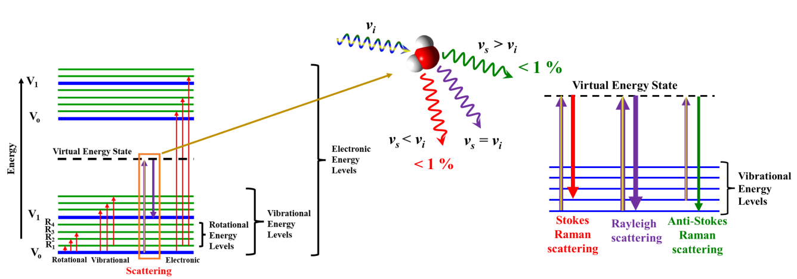
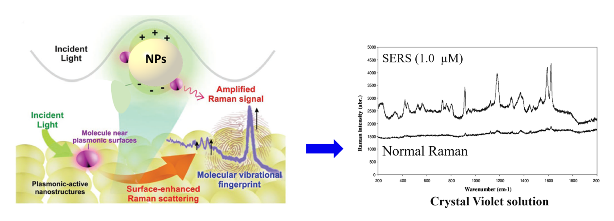
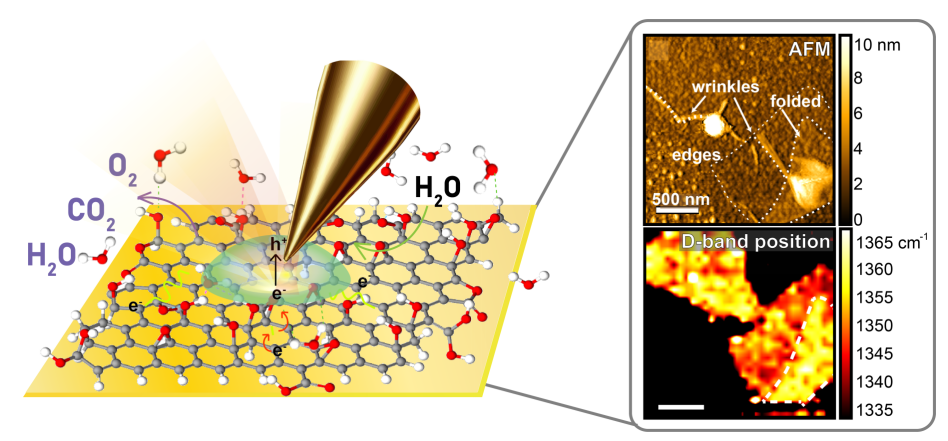
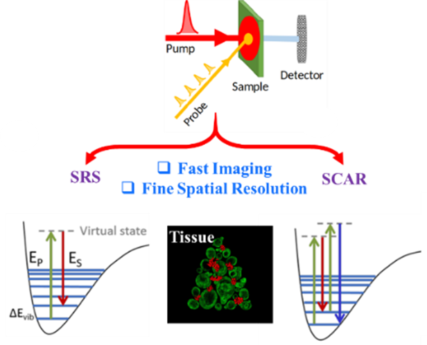

#### 引言

拉曼光谱是一种重要的振动光谱技术，通过分析光的非弹性散射（即拉曼散射）来探测分子的振动状态。这项技术能够在不破坏样品的情况下提供丰富的材料结构、电子和动态信息，因而在物理化学、材料科学和生物物理等领域得到了广泛应用。

拉曼光谱的核心原理是单色光与样品相互作用后发生散射。当光照射到样品上时，大多数光子保持原有能量（瑞利散射），而少量光子因与分子振动相互作用而能量发生变化（拉曼散射）。这些能量的变化对应于样品内部分子的振动模式，从而生成特有的光谱指纹，可以用来分析材料的化学组成和结构特征。

928年，C.V. Raman首次发现了拉曼效应，这一重要发现为光谱学的发展奠定了基础，并因此获得诺贝尔物理学奖。拉曼散射可分为斯托克斯散射和反斯托克斯散射。斯托克斯散射表现为光子失去能量，波长变长，而反斯托克斯散射则表现为光子获得能量，波长变短。通常，斯托克斯散射更为常见，其与反斯托克斯散射的强度比可以提供关于样品温度和振动态的关键信息。

Figure 1: &nbsp;Illustration of a basic Raman spectroscopy setup and energy diagram of Raman and IR processes...

#### 传统拉曼光谱的局限性

尽管传统拉曼光谱具有许多优势，但仍然存在一些关键挑战。首先是灵敏度较低，由于拉曼散射事件的发生概率极低，检测低浓度分子通常较为困难。此外，拉曼光谱的空间分辨率受光的衍射极限制约，难以解析200纳米以下的结构，这在纳米尺度成像中形成瓶颈。另外，某些样品可能产生强烈的荧光背景，掩盖或干扰拉曼信号，降低光谱质量。

为了应对这些挑战，科学家们开发了多种增强技术，通过引入等离子体共振效应和非线性光学过程，显著提升了拉曼光谱的灵敏度和分辨率。

#### 等离子体增强拉曼光谱

表面增强拉曼光谱（SERS）是克服传统拉曼技术局限性的重大进展之一。SERS通过利用纳米结构金属表面（如金或银）的表面等离子共振（SPR）来增强灵敏度。当分子吸附在这些等离子表面或其附近时，局域电场会显著放大拉曼信号。SERS的这种增强效应使其能够检测微量分析物，非常适合实时监测分子相互作用和结合事件。

尽管SERS具有巨大的潜力，但在信号增强的可重复性和均匀性方面仍面临诸多挑战。实现一致的“热点”（电磁场增强最强的区域）非常困难，因为等离子纳米结构的形貌、尺寸和分布存在差异，导致信号强度不一致。解决这些问题需要探索新的等离子体材料，并将SERS与微流控、机器学习和便携式传感器等技术相结合，以增强实时检测能力并扩大其实际应用。此外，将SERS扩展到生物系统中仍是活跃的研究领域，因为非特异性结合或背景信号的干扰常常降低准确性。

针尖增强拉曼散射（TERS）结合了SERS和扫描探针显微镜（SPM），如原子力显微镜（AFM）或扫描隧道显微镜（STM）。TERS通过将金属尖端探针（如金或银）靠近样品表面，利用探针尖端附近的强局部电场放大拉曼信号，实现超高分辨率化学成像，分辨率可达纳米级别。

Figure 2: Schematic of plasmon resonance in SERS; showing the interaction between plasmonic nanoparticles and analyte molecules. SERS vs Raman spectrum

TERS可以实现对样品表面分子排列、石墨烯缺陷以及生物大分子的精准分析。它在材料科学和生物学领域均具有重要应用价值。然而，TERS的性能受探针制造和稳定性影响较大，探针在使用过程中容易损耗，导致重复性降低。此外，TERS生成的超光谱数据集非常庞大，数据处理和分析复杂性较高，研究人员正利用机器学习等新技术提升数据分析效率。

Figure 3: Diagram of TERS showing a plasmonic tip interacting with molecules on the substrate surface.

#### 非线性光学拉曼技术

非线性光学拉曼技术，如受激拉曼散射（SRS）和相干反斯托克斯拉曼散射（CARS），进一步提升了拉曼光谱的灵敏度和抗干扰能力。

受激拉曼散射（SRS）通过利用强泵浦激光驱动受激发射来放大拉曼信号，产生更强、更容易检测的信号。与依赖罕见非弹性光子散射的自发拉曼散射不同，SRS仅在泵浦光与斯托克斯光共同作用于样品时生成信号，确保对振动模式的选择性检测。SRS不仅增强了灵敏度，还显著降低背景噪声，非常适合对活细胞和组织进行高速、无标记成像。实时跟踪分子动态有助于深入了解生物过程，如脂质代谢和蛋白质相互作用。

相干反斯托克斯拉曼散射（CARS）通过非线性光学过程生成高于激发光频率的反斯托克斯信号，从而有效提升信噪比并抑制背景荧光。CARS擅长对具有强自荧光的生物样品进行高对比度成像，使其成为研究活细胞分子结构和动态过程的重要工具。

近年来，拉曼光谱技术不断突破自身极限。时间分辨拉曼光谱捕捉超快分子动力学过程，为反应路径和瞬态状态提供重要见解。极端条件下的拉曼光谱研究（如强磁

场、高压和低温）揭示了行星科学和超导性材料的新特性。此外，量子和非线性拉曼光谱探索光与物质的新型相互作用，为量子物理和新材料研究提供了新的思路。

Figure 4: Energy diagram of CARS and SRS.

