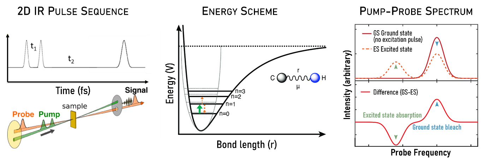
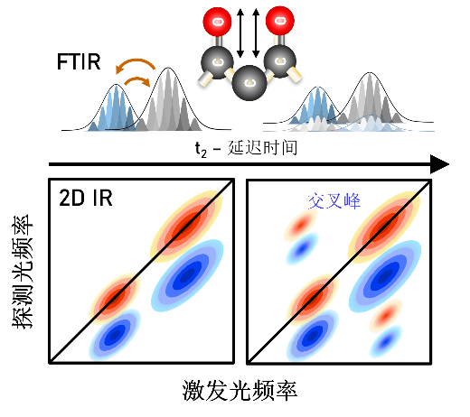
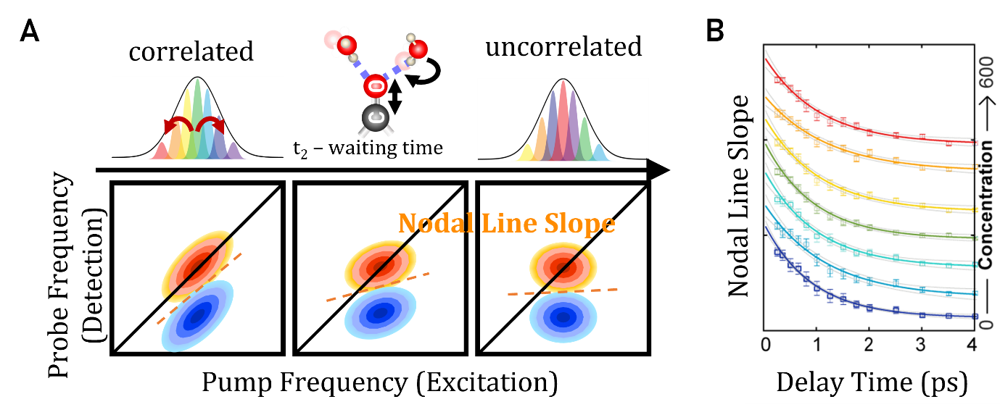

<h4 class="concept-subtitle article-note">从振动频率到分子动力学：飞秒光谱如何测量分子运动</h4>

分子从不静止。氢键持续断裂与重组，溶剂分子不断在溶质周围重排，蛋白质在多种构象之间来回涨落。这些运动发生在皮秒尺度——即10⁻¹²秒——却直接决定了分子如何相互识别、蛋白质如何折叠与错折，以及生物组装体如何形成与溶解。

常规红外光谱测量分子吸收哪些频率，提供的是结构快照。二维红外光谱（2D IR）则更进一步：通过飞秒激光脉冲序列，追踪振动响应如何随时间演化，它直接在运动实际发生的时间尺度上测量分子动力学。频率分辨率与飞秒时间分辨率的结合，使2D IR成为观察复杂体系中分子动态行为的独特工具。

#### 从静态结构到分子动力学

##### 为什么分子动力学至关重要

要理解2D IR的价值，首先需要认识到：决定分子功能的，往往不是静态结构，而是结构如何随时间涨落。

以水中的氢键为例。液态水中，每个水分子与邻近水分子形成氢键，但这些键在1至3皮秒内便会断裂重组。这种快速重组是水作为溶剂发挥作用的基础。当蛋白质或其他生物分子存在时，周围水的氢键动力学发生改变，这种改变直接影响分子识别的特异性、蛋白质的稳定性，乃至相分离的发生与否。

常规红外光谱无法捕捉这些动态信息，因为它将时间上的涨落平均掉了——得到的是所有分子、所有构型的叠加信号，而非特定时刻、特定环境中的瞬态行为。2D IR的设计逻辑正是为了突破这一局限。

#### 从一维到二维

##### 2D IR与常规红外光谱的本质区别

常规红外光谱回答的问题是：这个分子吸收哪些频率？结果是一维的吸收-频率曲线，可以识别官能团和二级结构，却对动力学保持沉默。

2D IR提出的是不同的问题：分子在某个频率被激发后，接下来发生了什么？通过将信息展开在激发频率和检测频率两个轴上，并记录光谱如何随等待时间演化，2D IR揭示了一维光谱看不到的两类信息：振动模式之间的耦合，以及分子环境随时间的动态变化。

2D IR的概念先驱是二维核磁共振（2D NMR）。2D NMR通过揭示核自旋之间的相关性而非孤立共振，彻底改变了结构生物学。将相似思路应用于分子振动的挑战是实验上的：振动运动发生在飞秒尺度（10⁻¹⁵秒），需要相应的超快激光脉冲才能追踪。这一技术在1990年代随着飞秒激光系统的发展而成熟，并于2000年前后实现了第一批真正意义上的2D IR实验。

#### 实验原理

##### 2D IR如何工作

2D IR光谱测量分子在被超快红外激光脉冲扰动后，振动激发如何演化和相互作用。

在典型实验中，一组飞秒红外脉冲以受控方式与样品相互作用。现代2D IR实验中，激发频率轴通过对相干时间 t₁ 进行傅里叶变换来生成，而非直接扫描红外频率。第一对脉冲（泵浦脉冲）激发特定振动模式，在体系内建立振动相干。

经过可控的等待时间 t₂ 后，第三个脉冲探测分子体系的演化。通过系统改变脉冲间的时间延迟并记录非线性振动响应，研究者重建出二维光谱，揭示振动模式的耦合方式以及分子环境如何随时间演化。

等待时间 t₂ 是2D IR实验的关键变量。通过测量不同 t₂ 下的二维光谱，我们追踪分子环境的动态演化，从而提取氢键重排速率、溶剂重组时间尺度和构象交换动力学。

图1. 2DIR的基本原理

#### 读懂2D IR谱图

##### 对角峰、交叉峰与谱线形状

2D IR光谱以二维等高线图或伪彩图的形式呈现。横轴是激发（泵浦）频率，纵轴是检测（探测）频率。信号强度由颜色或等高线密度表示，正负峰分别来自基态漂白（ground-state bleach）和激发态吸收（excited-state absorption）。

图2. 二维红外光谱中的交叉峰的示意图：当两个振动模式存在相互作用时，交叉峰会在二维光谱中显现，峰位置和强度可以揭示分子内部不同振动模式之间的耦合程度。

##### 对角峰

对角峰位于激发频率等于检测频率的对角线上，对应常规红外光谱中可见的同一基频振动，反映各振动模式对其局域环境的响应。在较短等待时间下，对角峰沿对角线方向拉伸，这是非均匀展宽的特征：样品中不同分子处于略微不同的局域环境中，因此吸收频率略有差异，叠加后形成沿对角线延伸的峰形。

##### 交叉峰

当两个振动模式存在耦合时，在非对角线位置出现交叉峰。交叉峰的出现是分子间相互作用的直接证据：共享化学键的两个振动、处于氢键距离内的两个基团，或正在发生能量转移的两个模式，都会产生交叉峰。交叉峰的位置、强度和时间演化，揭示了在一维光谱中隐藏的结构关联和动态信息，在非均质或动态涨落的体系中尤为重要。

对角峰揭示孤立振动，交叉峰揭示它们之间的相互作用。这一区别正是2D IR相较于常规红外光谱最核心的信息增量。

#### 谱扩散与分子动力学

##### 谱线形状如何编码环境动力学

随着等待时间 t₂ 增加，2D IR谱线形状发生演化：初始沿对角线拉伸的对角峰逐渐变为圆形。这一过程称为谱扩散，反映了随着分子环境涨落、初始频率相关性的衰减——振动频率逐渐忘记自己的起始状态。

谱扩散的速率并非噪声，而是信号：它编码了分子运动的时间尺度。谱扩散慢，意味着环境涨落缓慢；谱扩散快，意味着分子环境快速重组。具体来说，谱扩散速率包含的信息包括：

<ul class="list-paddingleft-2">
 <li>
氢键断裂与重组的速率
</li>
 <li>
溶剂分子在溶质周围重排的速率
</li>
 <li>
蛋白质在不同构象之间采样的速率
</li>
</ul>

图3. A. 二维红外光谱中的光谱扩散和线型分析示意图，振动探针与溶液环境的能量交换导致泵浦光与探测光频率去相关；B. 中心线斜率随t₂延迟时间呈指数衰减。弛豫时间通常反映振动探针周围局域化学环境的动态变化。

定量上，谱扩散由频率-频率相关函数（FFCF）描述——它度量零时刻的振动频率与稍后时刻同一频率之间的相关性。两个常用的实验可观测量——节线斜率（NLS）和中心线斜率（CLS）——都随着频率相关性的丧失而从1衰减至0。将这一衰减拟合为指数或多指数模型，即可直接给出环境涨落的时间尺度和振幅。

谱扩散反映的是振动模式周围分子环境的重组速度。这一可观测量将2D IR与其他光谱技术区别开来：其他方法看到的是结构，2D IR看到的是结构如何随时间涨落。

#### 实际应用

##### 2D IR在复杂体系中能揭示什么

2D IR的独特价值在于将分子结构与分子动力学直接联系起来。它不仅给出静态振动频率，更揭示分子相互作用如何在超快时间尺度和非均质空间环境中演化。这一能力在局域结构、分子间相互作用和动态涨落紧密耦联的体系中尤为重要。

##### 氢键动力学与溶剂化

许多分子体系的功能由发生在飞秒至皮秒尺度的氢键重排和溶剂涨落主导。由于振动频率对局域静电环境极为敏感，2D IR可以直接探测液态水、界面和生物体系中氢键网络的重组动力学。

在水溶液和非均质环境中，谱扩散测量揭示局域分子环境涨落和失忆的速率。界面处的氢键动力学可与体相水显著不同，导致分子柔性、能量弛豫路径和分子间相互作用的改变。这些效应在拥挤生物体系、软材料和受限分子环境中尤为突出。

在我们实验室的工作中，2D IR测量直接揭示了不同拥挤剂——聚乙二醇、各类糖分子——如何减缓氢键弛豫时间。这些动力学差异不是结构快照所能看到的，但它们对蛋白质稳定性和分子识别有直接后果。<a href="../../Publications.htm">→ 参见我们关于拥挤与界面动力学的研究方向</a>

##### 蛋白质构象涨落与生物分子组织

蛋白质和生物分子组装体是本征动态的体系，而非刚性结构。不同二级结构——α螺旋、β折叠——在2D IR谱中产生各具特征的振动耦合模式，使研究者能够以高结构敏感性探测构象组织。

除静态结构判断外，2D IR可以直接监测超快构象涨落、瞬态分子间相互作用和动态非均质环境。这些能力对于研究本征无序蛋白、生物分子凝聚体、膜相关组装体和非平衡生物组织越来越重要。

在我们关于LplA液-液相分离的工作中，2D IR分辨了相变过程中亚皮秒主链涨落和水合重排，直接揭示了构象切换与相边界之间的耦联。→ 参见我们关于相分离与构象动力学的研究

##### 分子间耦合与分子识别

2D IR谱中的交叉峰提供振动耦合、分子间相互作用和能量转移路径的直接证据，可揭示分子在复杂环境中的相互作用方式——包括配体结合、溶剂介导的相互作用和超分子组装过程。

在我们关于混合胶束体系的工作中，2D IR结合分子动力学模拟直接测量了胶束-蛋白质界面的氢键谱扩散速率，揭示了界面水合动力学——而非结构或热力学参数——才是决定药物-蛋白质结合亲和力的关键变量。<a href="../../Publications.htm">→ 参见我们关于药物递送与界面动力学的论文</a>

##### 超快化学交换与能量流

由于2D IR直接探测非平衡振动动力学，它对化学交换过程、能量再分配和超快分子间弛豫路径的研究尤为有效。

氢键切换、溶剂交换、构象互变和振动能量转移，均可通过谱相关性随时间的演化来监测。追踪谱相关性的衰减方式，研究者可以定量获得复杂体系中环境涨落和分子弛豫过程的速率。

#### 常见问题

##### 2D IR实际上测量的是什么？

2D IR测量振动模式如何在超快时间尺度上相互作用并演化。与主要报告振动频率的常规红外光谱不同，2D IR揭示振动耦合、能量转移、结构涨落和环境动力学——它测量的不是分子是什么样的，而是分子如何随时间运动。

##### 为什么2D IR被称为「动态」光谱？

因为2D IR追踪振动频率如何在飞秒至皮秒时间尺度上变化，使研究者能够直接观察氢键重排、溶剂化动力学和构象涨落等过程。等待时间 t₂ 是一个真实的时间变量，而非拟合参数——光谱如何随 t₂ 演化，直接编码了分子运动的速率和幅度。

##### 2D IR谱中的交叉峰意味着什么？

交叉峰在两个振动模式发生相互作用或能量交换时出现。它们提供振动耦合、分子邻近性或体系内结构相关性的直接证据。交叉峰的出现、位置和时间演化，通常揭示在一维光谱中完全隐藏的信息——尤其在非均质或动态涨落的环境中。

##### 什么是谱扩散？

谱扩散描述的是分子的振动频率如何因局域环境的涨落而随时间变化。它反映了周围分子的动力学——溶剂重排、氢键涨落、构象变化。谱扩散慢，意味着分子环境缓慢改变；谱扩散快，意味着分子环境迅速重组。

##### 为什么2D IR特别适合研究生物体系？

许多生物过程由超快时间尺度上的瞬态相互作用和结构涨落主导。2D IR在这些时间尺度上原生操作，且振动频率对局域静电环境高度敏感，使其能够分辨蛋白质、膜、凝聚体和水合网络中的异质动力学——而这些是系综平均测量无法触及的信息。

##### 2D IR与分子动力学模拟如何结合使用？

在我们实验室，2D IR与MD模拟的结合是标准工作流程。MD模拟提供原子轨迹，从中计算出频率-频率相关函数（FFCF）；实验测量的FFCF与之直接比较，互相验证，共同给出分子动力学的原子级解释。这种结合克服了单纯光谱测量缺乏空间分辨率、单纯模拟缺乏实验约束的局限。

#### 在我们实验室

##### 2D IR如何支撑我们的研究

在尤晓实验室，2D IR是测量分子动力学的核心工具——但不是唯一工具。我们将其与近场纳米成像和多尺度分子模拟相结合，在时间和空间两个维度上同时分辨生物体系中的分子涨落。

具体而言，2D IR在我们的工作中承担三个角色：

<ul class="list-paddingleft-2">
 <li>
直接测量氢键弛豫时间尺度：在拥挤环境、脂质界面、药物-胶束-蛋白质界面中，量化氢键动力学如何偏离体相水行为
</li>
 <li>
分辨凝聚体内的主链和水合动力学：在液-液相分离的液态和固态之间追踪动力学变化，识别病理性聚集的分子前兆
</li>
 <li>
验证分子动力学模拟：将实验FFCF与计算FFCF直接比较，为光谱特征提供原子级机制解释
</li>
</ul>

我们持续的目标是：让分子动力学不仅仅是可测量的，而是可预测的、可设计的。有关当前研究方向和具体成果，请见我们的研究页面和论文列表，或直接与我们联系。

尤晓实验室 · 时空分辨光谱成像实验室 · 西湖大学工学院 · youxiao@westlake.edu.cn · 更新于 2026年5月

