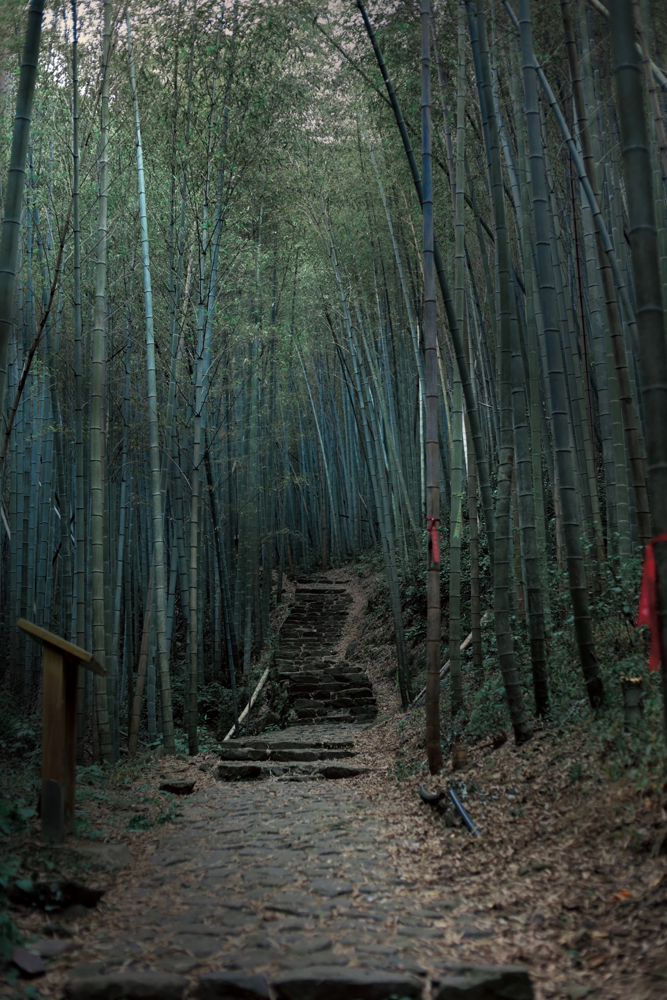
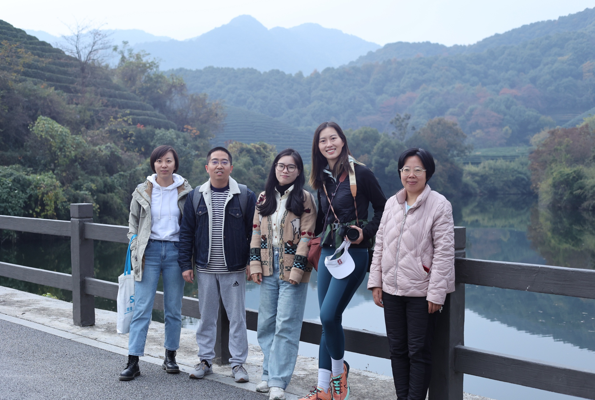
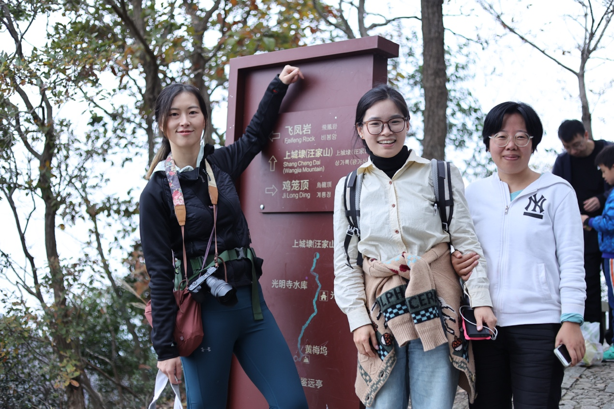
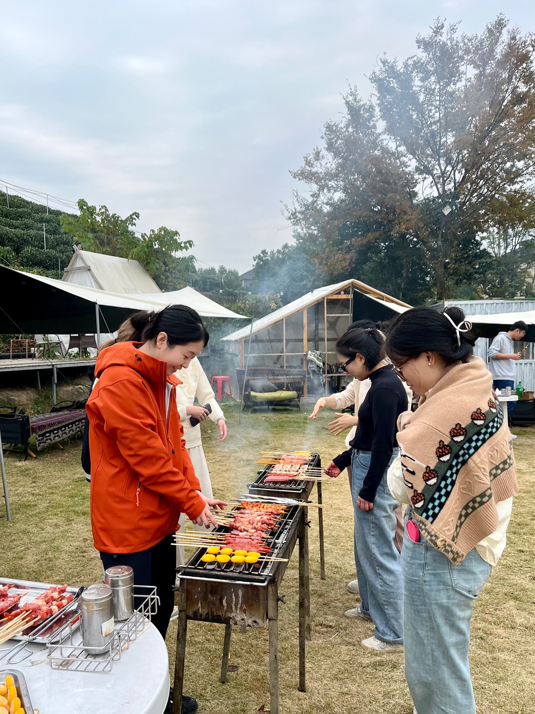

On November 26, 2023, taking advantage of the most beautiful autumn scenery in Hangzhou, You Xiao Laboratory, together with Nie Weixuan's team, Xiao Fangzhou's team and Zhang Yanyan's team, opened an autumn date full of laughter in the picturesque West Lake Longwu Tea Town.

The morning sun shines on the tea garden, and more than a dozen scientific researchers temporarily put down their experiments and become "autumn explorers". Everyone climbs up the steps along the tea mountain trail, the golden ginkgo and the green tea trees complement each other, and the mountains are filled with laughter and chatter. The barbecue session after going down the mountain is even more exciting: the skillful hands who usually operate precision instruments are now showing their skills in front of the grill. Some people rigorously "turn over the chicken wings regularly", just like controlling the reaction time; some people innovate the combination of skewers and ingredients, calling it "interdisciplinary integration". In the curling smoke, praises of "this result is well grilled" burst out from time to time.

This team building not only allowed everyone to appreciate the autumn charm of the "Tea Capital", but also promoted cross-team communication in a relaxed atmosphere. After the event, the friends said: "I am fully charged. See you in the lab on Monday!"

