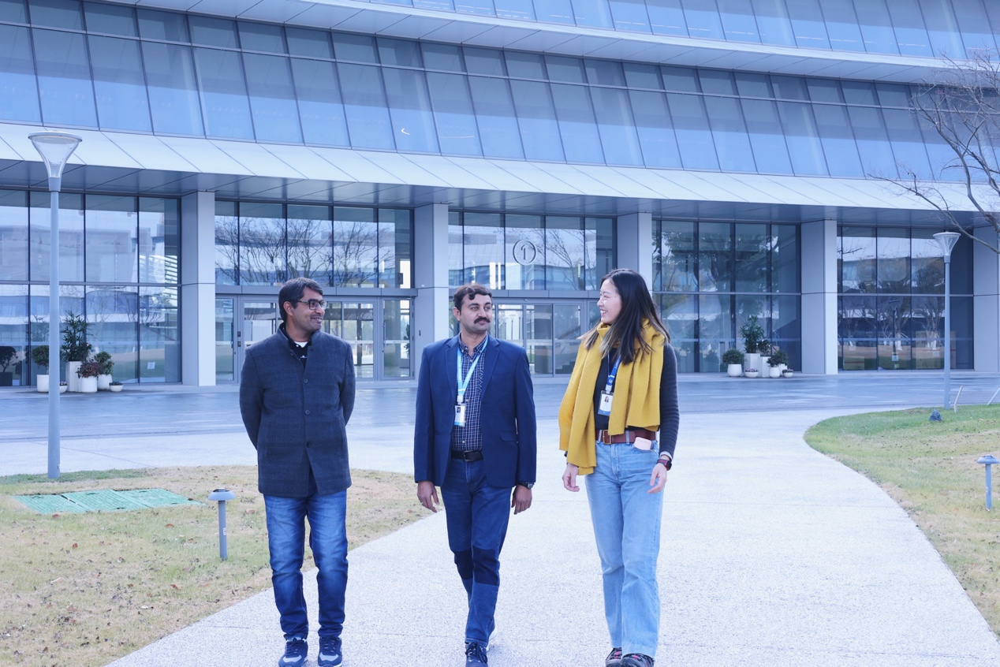

On January 5, 2024, the laboratory welcomed two outstanding Pakistani postdocs, MUHAMMAD SOHAIL and MUHAMMAD HAROON, who will bring interdisciplinary research vitality and international scientific research perspectives to the team.

Dr. MUHAMMAD SOHAIL has extensive research experience in the fields of micellar solutions, electrolytes, drug delivery systems, and is proficient in spectroscopy, rheology, and material characterization techniques. Dr. MUHAMMAD HAROON focuses on cutting-edge fields such as plasma nanomaterials, biosensors, and surface enhanced vibrational spectroscopy (SERS, TERS), especially in the interaction between nanomaterials and drugs, bioimaging, and density functional theory (DFT) calculations. His research will promote the laboratory's innovative exploration in the direction of nanobiotechnology and spectral analysis.

The joining of the two postdocs not only strengthens the laboratory's international cooperation network, but also provides new ideas and methods for the team's research in interdisciplinary fields such as materials science, biomedicine, and nanotechnology. We look forward to their fruitful scientific research and contribution of wisdom and strength to the development of the laboratory!

Once again, we welcome SOHAIL and HAROON to join our scientific research family! 🎉

