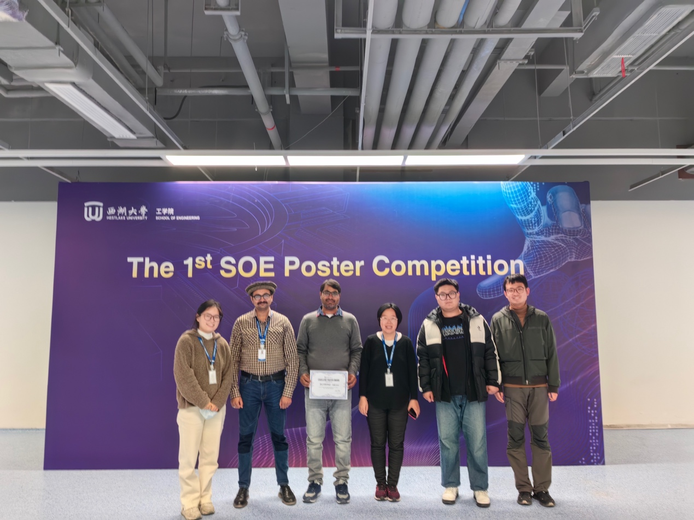

On January 9, 2024, at the first academic poster competition held in the School of Engineering, MUHAMMAD HAROON, a new postdoctoral fellow in the laboratory, won the "Best Poster Award" with his outstanding research results and exquisite poster design after fierce competition and votes from judges!

Dr. Haroon's research focuses on plasma nanomaterials and biosensor technology, and his poster vividly demonstrates his innovative discoveries in this field. This honor is not only a recognition of his scientific research ability, but also shows the laboratory's achievements in cultivating international scientific research talents.

Congratulations to Dr. Haroon! Looking forward to him bringing more exciting scientific research results in the future! 🎉

