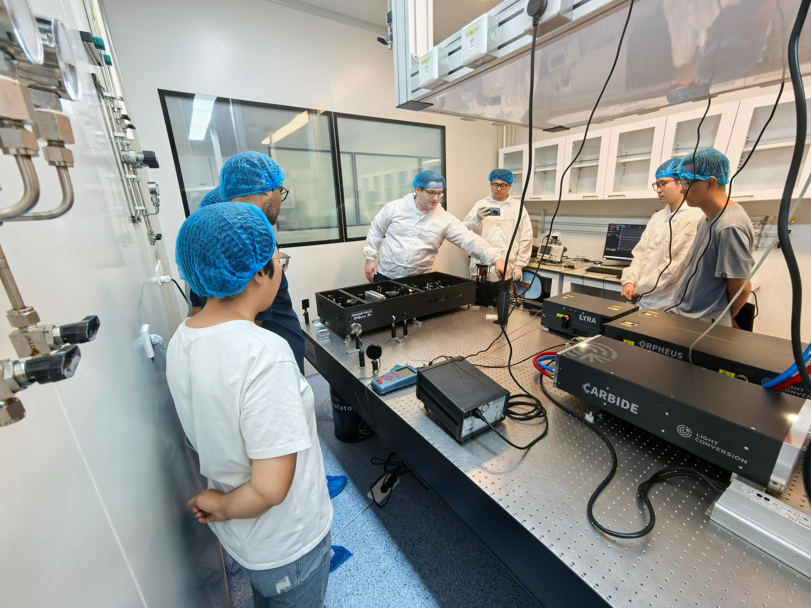
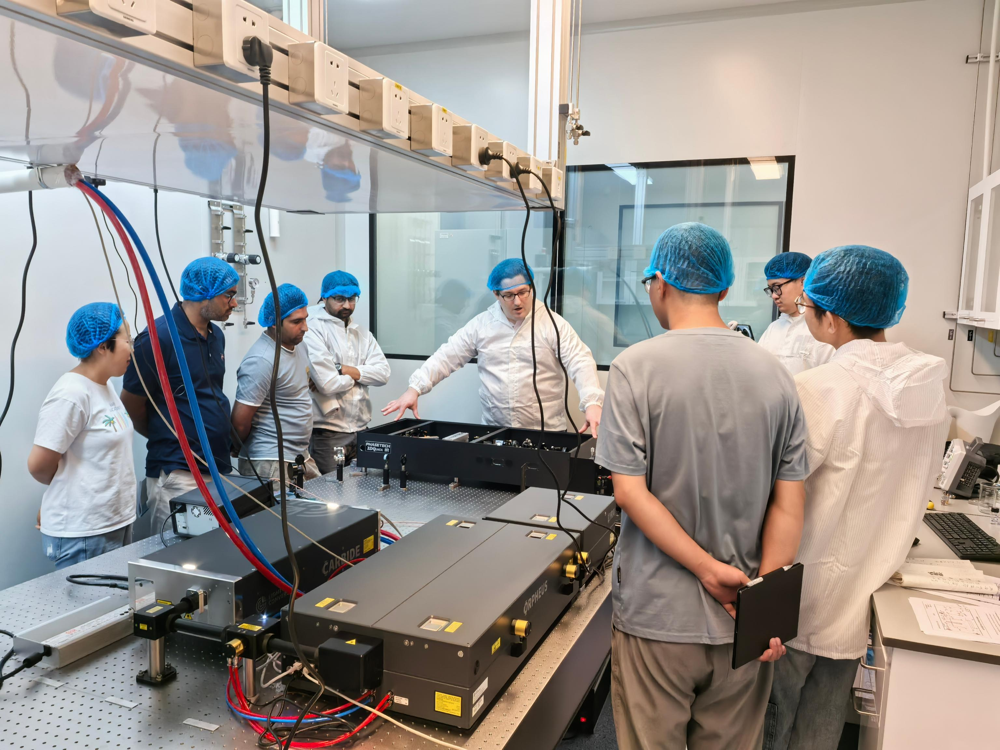

In August 2024, our laboratory received the long-awaited equipment for the 2DQuick IR system, a cutting-edge technology in ultra-fast 2D infrared spectroscopy. On August 22, Tom Brinzer, an engineer from PHASETECH, visited our lab to oversee the installation and signal debugging of the 2DQuick IR system. &nbsp;

Following the installation, Tom conducted comprehensive on-site training, providing technical guidance to our laboratory team. Each team member had the opportunity to operate key components of the system, gaining hands-on experience under his expert supervision. In August 2024, Given the advanced nature of ultra-fast 2D infrared technology, the team engaged in a stimulating discussion with Tom and other engineers, exploring the complex theoretical foundations and technical aspects behind the equipment. Additionally, Tom shared a detailed data analysis report on the 2DQuick IR, offering valuable insights into its capabilities and potential applications.

This marks a significant milestone in our laboratory's ongoing efforts to advance research in ultra-fast spectroscopy, and we look forward to leveraging this powerful technology in our future projects.

