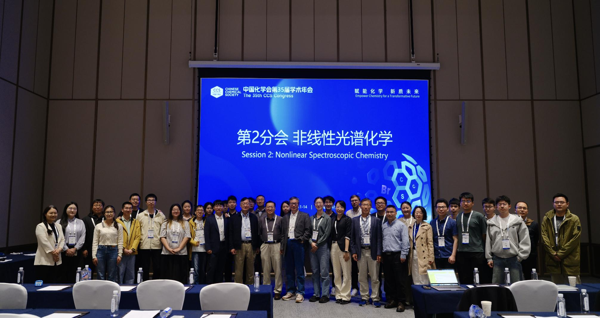
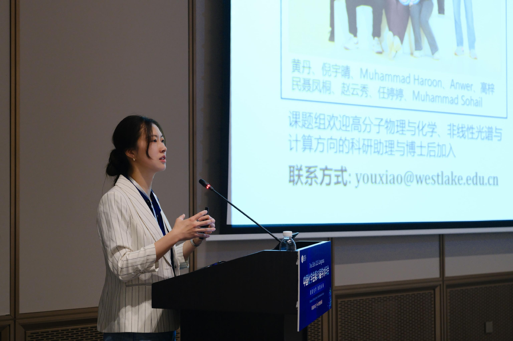
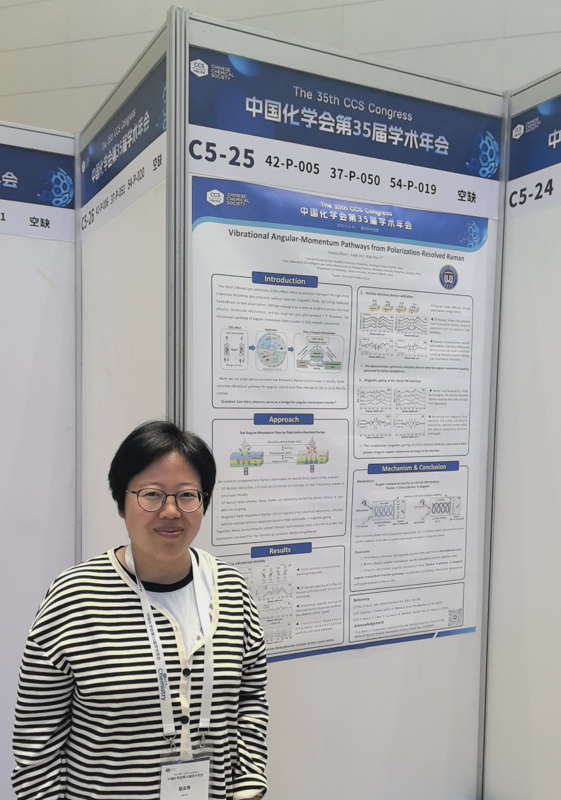

From April 11 to 14, 2026, the 35th Academic Annual Meeting of the Chinese Chemical Society was successfully held in Chongqing. Members of the Westlake University Xia You Group attended the conference and engaged in extensive discussions with researchers and scholars from universities and institutes across China. The meeting also provided a valuable opportunity to learn about the latest advances and emerging trends in the field of chemistry.

During the conference, Prof. Xia You delivered an oral presentation entitled <em>“Regulation of Drug–Protein Binding by Hydrogen-Bond Dynamics at Micellar Interfaces.”</em> In the talk, he introduced the group’s recent research progress on molecular interactions at micellar interfaces and their biological effects, which attracted considerable interest and discussion among attendees.

In addition, postdoctoral researcher Yunxiu Zhao presented her latest work in the poster session. Through interactions with researchers from diverse fields, she broadened her academic perspective and gained new inspiration from several cutting-edge research directions.

Participation in the conference enabled the group to strengthen academic exchanges, deepen its understanding of current developments in chemistry, and explore new ideas for future research.

