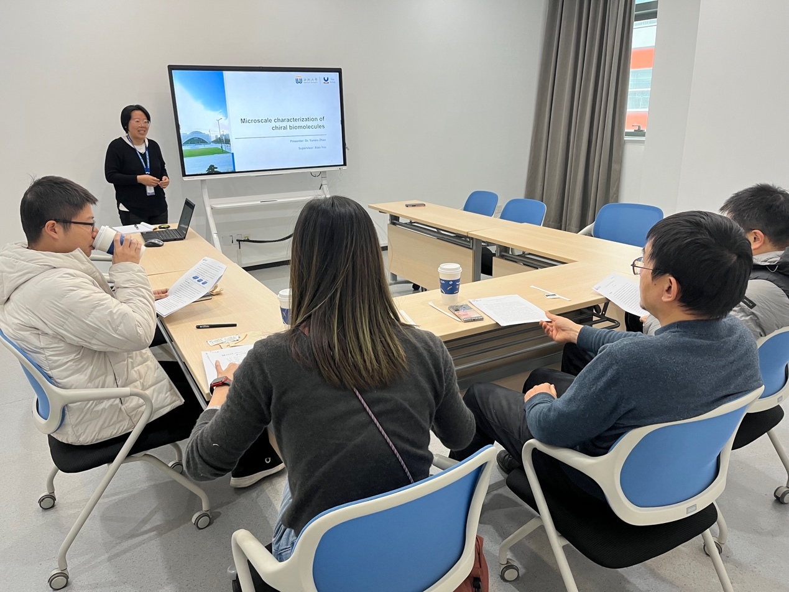

2023年12月26日，赵云秀博士的开题报告《手性生物分子的微尺度光学表征》在评审会上获得专家组高度评价，顺利通过！

赵博士的报告聚焦生物手性分子的微尺度光学特性研究，她创造性地提出将先进光学表征技术应用于生物手性体系的研究思路。作为实验室"手性探索小分队"的核心成员，赵博士在生物分子自旋选择研究方面展现出独特见解，其创新性的研究方案令在场专家频频点头。

据悉，该研究有望为生物手性识别提供新的表征方法和理论依据。让我们期待赵博士在未来研究中取得突破性进展！

