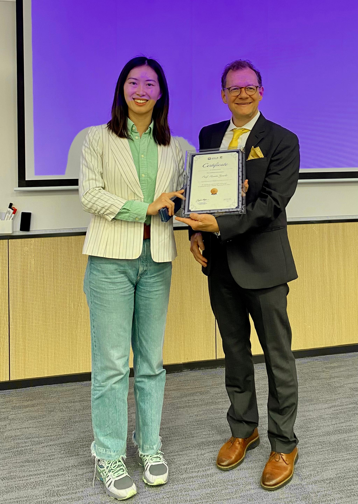
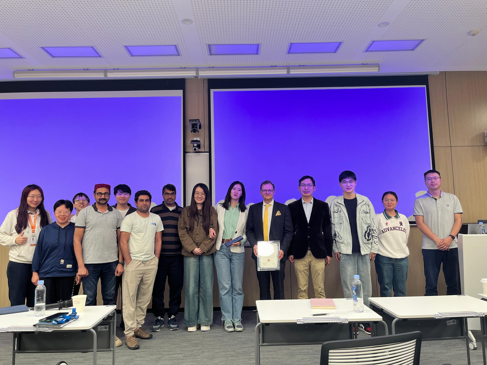
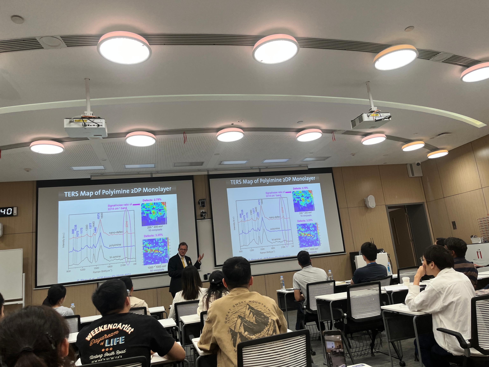
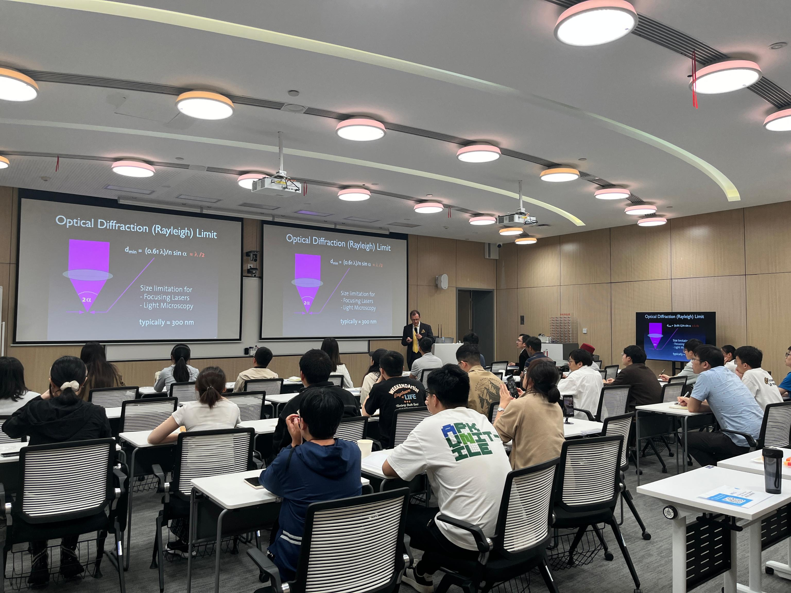

2024年4月9日，尤晓课题组邀请来自ETH Zurich的Renato教授来到西湖大学，以《Nanoscale Surface Analysis via Tip-enhanced Raman Spectroscopy》分享了基于尖端增强拉曼光谱的纳米级表面分析相关内容。

Renato Zenobi教授是瑞士苏黎世联邦理工学院（ETH Zurich）的著名分析化学家，同时也是该校有机化学实验室的教授。他于1961年出生于苏黎世，1990年在斯坦福大学获得物理和分析化学博士学位，师从国际知名学者Richard N. Zare教授。自2000年起，Zenobi教授成为ETH的全职教授，并担任瑞士分析化学首席教授。Renato Zenobi教授的研究主要集中在质谱分析和光谱分析领域，是针尖增强拉曼光谱（TERS）的主要发明人之一，该技术能够在纳米尺度上进行分子分析和成像，这一研究极大的推动了分析化学和生命科学的发展。

Renato Zenobi教授本次到访西湖大学，为师生提供了一个非常难得的交流机会，讲座结束后同学们积极发言，围绕TERS展开了热烈的探讨。

