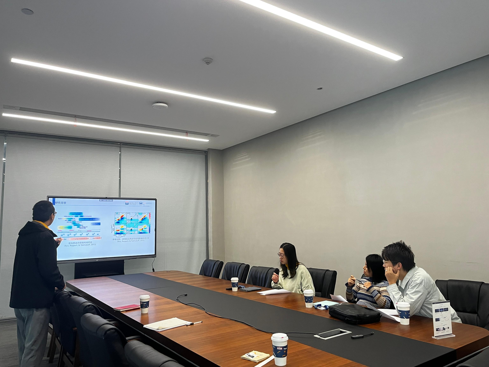

2024年11月7日，倪宇晴博后的开题报告《超快光谱的理论模拟》得到现场专家的一致认可。超快光谱如飞秒瞬态吸收、二维红外光谱、超快拉曼光谱等可以通过极短脉冲光探测分子、材料或生物体系的动态过程，为揭示光诱导电荷转移、能量弛豫、化学键断裂等超快现象提供实验依据。然而，实验数据往往包含复杂的信号叠加，需依赖理论模拟进行定量解析和机理阐释。接下来的时间里，宇晴将与实验室成员紧密合作，让理论模拟与超快实验的协同，揭示复杂液体中超快动力学、分子相互作用以及结构特性。

