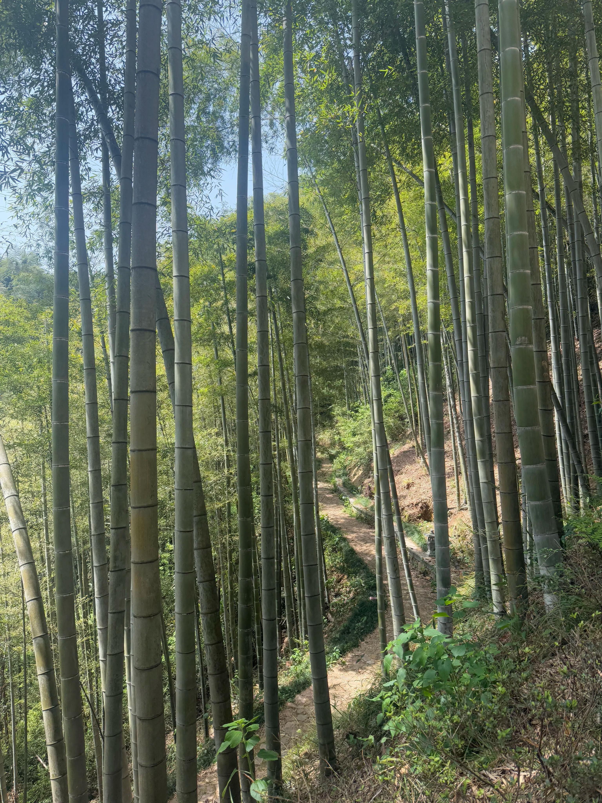
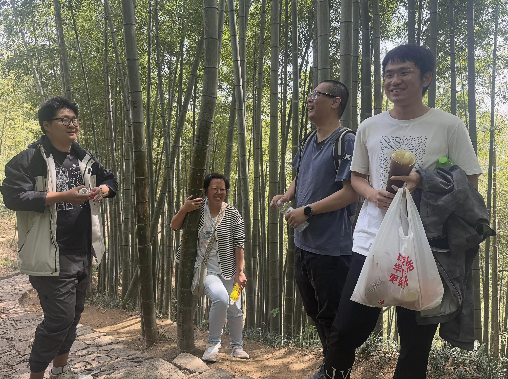
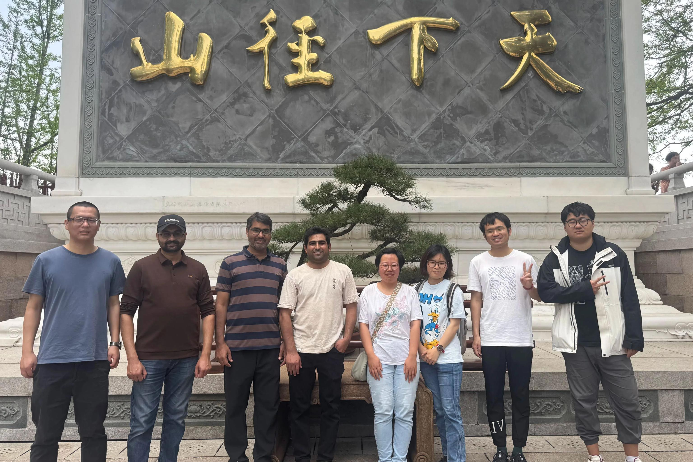

4月10日，实验室全体成员前往余杭径山寺春游，到达桐桥停车场后，在热心村民的指引下我们找到了徒步入口。2km的徒步路线全程美景，遍山的竹海在春风的吹拂下像绿浪般摇曳。沿途不时有蓝色尾翼的壁虎出没！大家都感到十分惊奇！巴基斯坦博后看到路边的茶树好奇，云秀为他们热心介绍，还摘了新鲜的嫩叶嚼出满口清香，这可是有名的径山禅茶呢！

大家边聊天边爬山，一路轻松愉快前行，很快便到达径山寺。我们先品尝了美味的素面，之后参观浏览了这座有名的寺庙。余杭径山寺位于浙江省杭州市余杭区径山镇，是中国佛教禅宗的重要寺院之一，享有“江南五大禅院之首”的美誉。径山寺始建于唐天宝四年（745年），由高僧法钦（国一大师）创建，距今已有1200多年历史。南宋时期，径山寺被列为禅宗“五山十刹”之首，超越灵隐寺、净慈寺等名刹，成为江南佛教中心。元末毁于战火，明代重建，后又历经多次修缮。20世纪80年代起，径山寺逐步恢复，如今已成为重要的佛教圣地和旅游景点。径山寺还是日本茶道的发源地之一。南宋时期，日本僧人圆尔辩圆将径山寺的禅茶文化带回日本，演变为日本茶道。如今径山茶宴已被列入人类非物质文化遗产，展现禅茶一体的文化传统。

