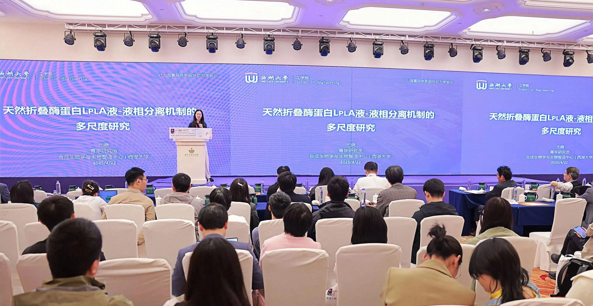
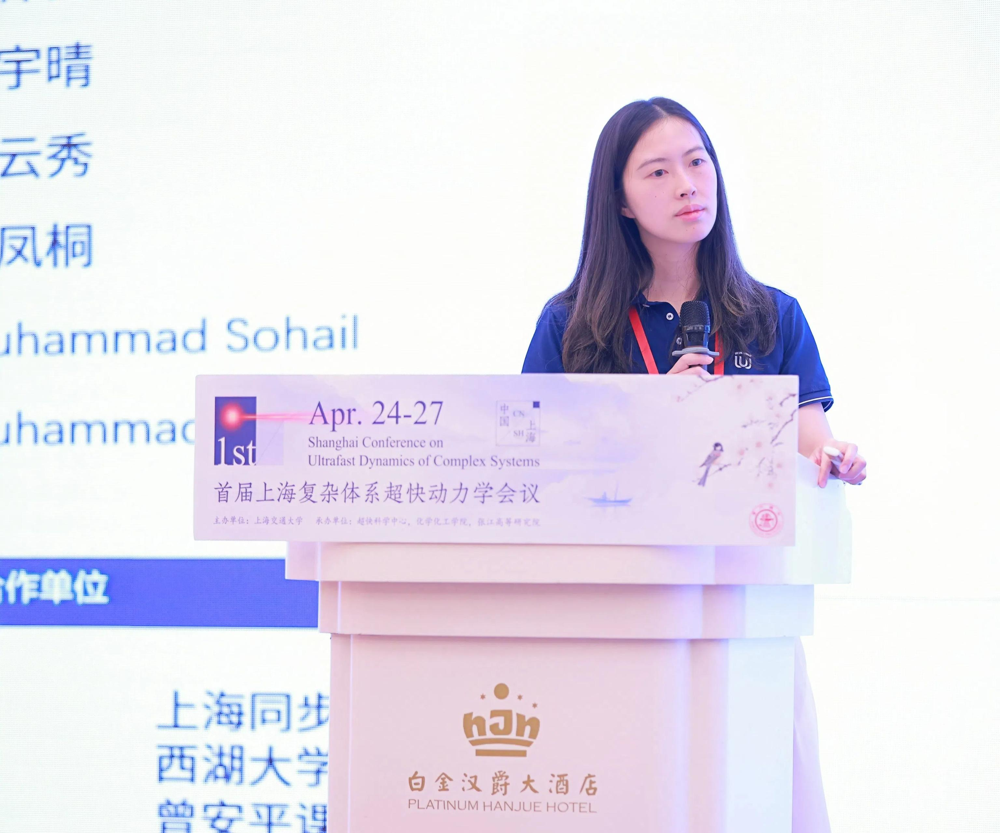
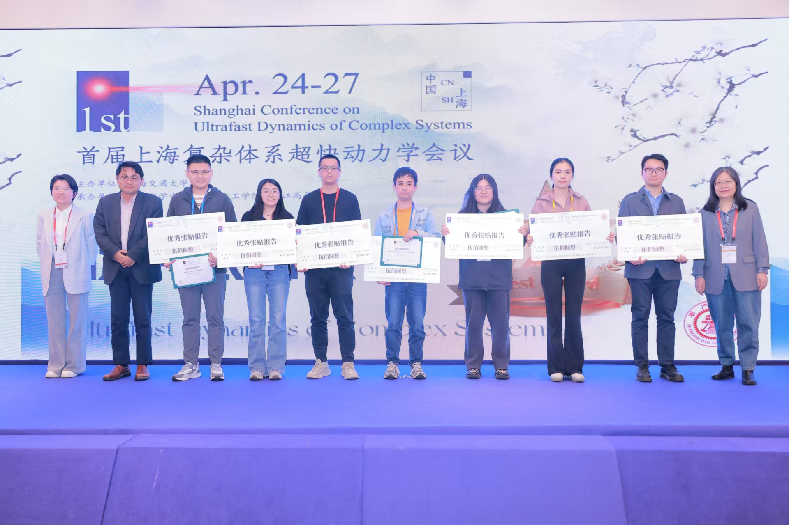

2025年4月25日——由上海交通大学主办的首届"上海复杂体系超快动力学会议"近日圆满落幕。本次会议以"超快动力学国际前沿探索"与"技术驱动的学科交叉"为主题，吸引了国内外众多专家学者参与，共同探讨超快光子与电子技术在多尺度物质科学中的突破性应用，以及飞秒至阿秒时间尺度下复杂体系动态行为的本质规律。&nbsp;&nbsp;

尤晓老师作为特邀嘉宾出席会议，并发表了题为《天然折叠酶蛋白LplA液-液相分离机制的多尺度研究》的学术报告。报告内容深入浅出，引发了现场师生的热烈讨论，为会议增添了重要学术亮点。&nbsp;&nbsp;

此外，尤晓老师团队的博士后倪宇晴和科研助理高梓民在会议中表现优异。他们不仅与同行学者进行了深入高效的学术交流，其合作制作的海报更凭借创新性和学术价值荣获大会"优秀海报奖"，并获得500元奖金。这一荣誉充分展现了团队在超快动力学领域的科研实力与合作精神。 &nbsp;

本次会议为复杂体系超快动力学研究提供了高水平的交流平台，推动了学科交叉与技术创新的深度融合。尤晓团队的成功参与，也为相关领域的未来发展注入了新的活力。
