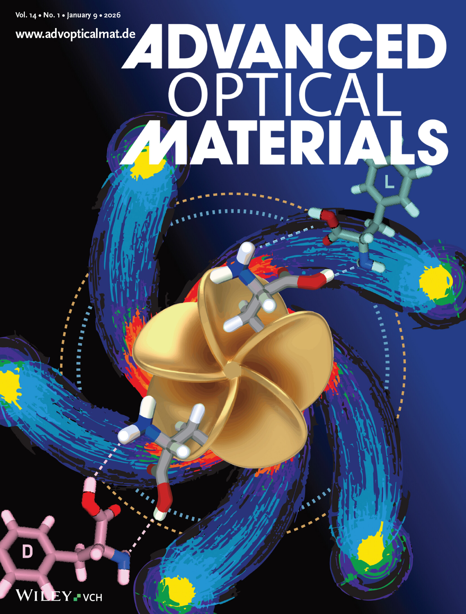

近日，我们团队的博士后研究员Muhammad Haroon博士在著名期刊《先进光学材料》上发表了一项重大研究突破。这项研究题为《手性金纳米螺旋桨：通过立体选择性结合设计等离子体手性以实现对映选择性识别》，介绍了一种新颖的双模式平台，巧妙地将金纳米结构的固有手性与靶向分子识别相结合。对映体（互为镜像的分子）在药理学等领域发挥着至关重要的作用，但由于它们具有相同的物理和化学性质，因此使用常规方法很难区分它们。Haroon博士的研究通过设计精确形状的金纳米螺旋桨解决了这一长期存在的挑战。这些纳米结构旨在与左旋和右旋分子进行不同的相互作用，从而实现高灵敏度和选择性的识别。该研究结合了复杂的纳米加工技术、先进的光学实验和计算模拟，证明这些手性纳米螺旋桨能够以惊人的精度检测对映体。这是通过立体选择性结合实现的，其中螺旋桨独特的等离子体手性增强了与特定分子镜像形式的相互作用。“这种创新方法为更智能的诊断、更安全的药物和下一代传感技术开辟了新的途径，”Haroon博士说道。“通过利用纳米级金的几何和光学特性，我们可以达到以前难以达到的精度水平。”

这项研究不仅可以改进药物开发流程（错误的对映体可能产生有害的副作用），还可以开发用于化学和生物检测的先进传感器。该平台的双模式功能兼具灵活性和增强的可靠性，使其成为研究和工业界的有力工具。不仅凸显了等离子体手性在纳米光子学中日益增长的潜力，也巩固了我们团队在材料科学与光学工程交叉领域的创新领导地位。&nbsp; &nbsp;

再次恭喜Muhammad Haroon！

文章链接：<a href="https://advanced.onlinelibrary.wiley.com/doi/10.1002/adom.202501589">https://advanced.onlinelibrary.wiley.com/doi/10.1002/adom.202501589</a>
